# Car Rental Microservices System

A distributed car rental platform built with Spring Boot microservices, demonstrating enterprise-grade architecture with clean code principles, SOLID design patterns, and event-driven communication.

---

## Table of Contents

1. [System Architecture](#system-architecture)
2. [Functional Requirements](#functional-requirements)
3. [Non-Functional Requirements](#non-functional-requirements)
4. [Technology Stack](#technology-stack)
5. [Project Structure](#project-structure)
6. [Microservices Overview](#microservices-overview)
7. [API Endpoints](#api-endpoints)
8. [Layered Architecture](#layered-architecture)
9. [Communication Patterns](#communication-patterns)
10. [Key Design Patterns](#key-design-patterns)
11. [Setup & Deployment](#setup--deployment)

---

## System Architecture

### Overall System Design

```mermaid
graph TB
%% Increased spacing between nodes
%% Using padding and line breaks for better visual separation

    Client["🖥️ Client Applications"]

    Client -->|"<span style='color:rgb(255, 127, 80);padding:2px 8px;border:none;background:rgb(15,17,26);'>HTTP</span>"| Gateway["🔗 API Gateway<br/>Spring Cloud Gateway<br/>Port: 9010"]

    Gateway -->|"<span style='background:rgb(15,17,26);color:rgb(26,188,156);padding:2px 8px;border:none;'>Service Discovery</span>"| Discovery["📡 Discovery Server<br/>Eureka<br/>Port: 8761"]

    Gateway -->|"<span style='background:rgb(15,17,26);color:rgb(255, 127, 80);padding:2px 8px;border:none;'>Route</span>"| RentalSvc["🚗 Rental Service<br/>Port: 8081<br/>PostgreSQL"]
    Gateway -->|"<span style='background:rgb(15,17,26);color:rgb(255, 127, 80);padding:2px 8px;border:none;'>Route</span>"| InventorySvc["📦 Inventory Service<br/>Port: 8082<br/>PostgreSQL"]
    Gateway -->|"<span style='background:rgb(15,17,26);color:rgb(255, 127, 80);padding:2px 8px;border:none;'>Route</span>"| FilterSvc["🔍 Filter Service<br/>Port: 8083<br/>MongoDB"]
    Gateway -->|"<span style='background:rgb(15,17,26);color:rgb(255, 127, 80);padding:2px 8px;border:none;'>Route</span>"| PaymentSvc["💳 Payment Service<br/>Port: 8084<br/>PostgreSQL"]
    Gateway -->|"<span style='background:rgb(15,17,26);color:rgb(255, 127, 80);padding:2px 8px;border:none;'>Route</span>"| InvoiceSvc["📄 Invoice Service<br/>Port: 8085<br/>MongoDB"]
    Gateway -->|"<span style='background:rgb(15,17,26);color:rgb(255, 127, 80);padding:2px 8px;border:none;'>Route</span>"| MaintenanceSvc["🔧 Maintenance Service<br/>Port: 8086<br/>MySQL"]

    RentalSvc -->|"<span style='background:rgb(15,17,26);color: rgb(197,52,255);padding:2px 8px;border:none;'>REST/Feign<br/>Retry Pattern</span>"| InventorySvc
    RentalSvc -->|"<span style='background:rgb(15,17,26);color: rgb(197,52,255);padding:2px 8px;border:none;'>REST/Feign</span>"| PaymentSvc
    MaintenanceSvc -->|"<span style='background:rgb(15,17,26);color:rgb(0,255,238);padding:2px 8px;border:none;'>REST/Feign</span>"| InventorySvc

    RentalSvc -->|"<span style='background:rgb(15,17,26);color: rgb(197,52,255);padding:2px 8px;border:none;'>Kafka Event</span>"| Kafka["📨 Kafka<br/>Port: 9092"]
    MaintenanceSvc -->|"<span style='background:rgb(15,17,26);color:rgb(0,255,238);padding:2px 8px;border:none;'>Kafka Event</span>"| Kafka
    InventorySvc -->|"<span style='background:rgb(15,17,26);color:rgb(240,204,0);padding:2px 8px;border:none;'>Kafka Event</span>"| Kafka

    Kafka -->|"<span style='background:rgb(15,17,26);color:rgb(225,55,122);padding:2px 8px;border:none;'>Consume</span>"| FilterSvc
    Kafka -->|"<span style='background:rgb(15,17,26);color:rgb(225,55,122);padding:2px 8px;border:none;'>Consume</span>"| InvoiceSvc
    Kafka -->|"<span style='background:rgb(15,17,26);color:rgb(225,55,122);padding:2px 8px;border:none;'>Consume</span>"| InventorySvc

    RentalSvc -->|"<span style='background:rgb(15,17,26);color: rgb(197,52,255);padding:2px 8px;border:none;'>Auth/OAuth2</span>"| Keycloak["🔐 Keycloak<br/>Port: 8080"]
    InventorySvc -->|"<span style='background:rgb(15,17,26);color:rgb(240,204,0);padding:2px 8px;border:none;'>Auth/OAuth2</span>"| Keycloak
    MaintenanceSvc -->|"<span style='background:rgb(15,17,26);color:rgb(0,255,238);padding:2px 8px;border:none;'>Auth/OAuth2</span>"| Keycloak

    RentalSvc -->|"<span style='background:rgb(15,17,26);color: rgb(197,52,255);padding:2px 8px;border:none;'>Traces</span>"| Zipkin["🔍 Zipkin<br/>Distributed Tracing<br/>Port: 9411"]
    InventorySvc -->|"<span style='background:rgb(15,17,26);color:rgb(240,204,0);padding:2px 8px;border:none;'>Traces</span>"| Zipkin
    PaymentSvc -->|"<span style='background:rgb(15,17,26);color:rgb(0,242,60);padding:2px 8px;border:none;'>Traces</span>"| Zipkin
    MaintenanceSvc -->|"<span style='background:rgb(15,17,26);color:rgb(0,255,238);padding:2px 8px;border:none;'>Traces</span>"| Zipkin

    RentalSvc -->|"<span style='background:rgb(15,17,26);color: rgb(197,52,255);padding:2px 8px;border:none;'>Metrics</span>"| Prometheus["📊 Prometheus<br/>Port: 9090"]
    InventorySvc -->|"<span style='background:rgb(15,17,26);color:rgb(240, 204, 0);padding:2px 8px;border:none;'>Metrics</span>"| Prometheus
    PaymentSvc -->|"<span style='background:rgb(15,17,26);color:rgb(0,242,60);padding:2px 8px;border:none;'>Metrics</span>"| Prometheus
    MaintenanceSvc -->|"<span style='background:rgb(15,17,26);color:rgb(0,255,238);padding:2px 8px;border:none;'>Metrics</span>"| Prometheus

    Prometheus -->|"<span style='background:rgb(15,17,26);color:rgb(26,129,255);padding:2px 8px;border:none;'>Visualize</span>"| Grafana["📈 Grafana<br/>Port: 3000"]

    ConfigServer["⚙️ Config Server<br/>Spring Cloud Config<br/>Port: 8888"]
    ConfigServer -->|"<span style='background:rgb(15,17,26);color:rgb(48, 172, 255);padding:2px 8px;border:none;'>Config</span>"| RentalSvc
    ConfigServer -->|"<span style='background:rgb(15,17,26);color:rgb(48, 172, 255);padding:2px 8px;border:none;'>Config</span>"| InventorySvc
    ConfigServer -->|"<span style='background:rgb(15,17,26);color:rgb(48, 172, 255);padding:2px 8px;border:none;'>Config</span>"| FilterSvc
    ConfigServer -->|"<span style='background:rgb(15,17,26);color:rgb(48, 172, 255);padding:2px 8px;border:none;'>Config</span>"| PaymentSvc
    ConfigServer -->|"<span style='background:rgb(15,17,26);color:rgb(48, 172, 255);padding:2px 8px;border:none;'>Config</span>"| InvoiceSvc
    ConfigServer -->|"<span style='background:rgb(15,17,26);color:rgb(48, 172, 255);padding:2px 8px;border:none;'>Config</span>"| MaintenanceSvc

%% Node Styles with better contrast
    style Client fill:#FF7F50,color:#FFFFFF,stroke:#1A252F,stroke-width:2px
    style Gateway fill:#E74C3C,color:#FFFFFF,stroke:#C0392B,stroke-width:2px
    style Discovery fill:#1ABC9C,color:#FFFFFF,stroke:#16A085,stroke-width:2px
    style ConfigServer fill:#008AE7,color:#FFFFFF,stroke:#2980B9,stroke-width:2px
    style Kafka fill:#D50047,color:#FFFFFF,stroke:#8E0038,stroke-width:2px
    style Keycloak fill:#2ECC71,color:#FFFFFF,stroke:#27AE60,stroke-width:2px
    style Zipkin fill:#E74C3C,color:#FFFFFF,stroke:#C0392B,stroke-width:2px
    style Prometheus fill:#3B00EE,color:#FFFFFF,stroke:#24009A,stroke-width:2px
    style Grafana fill:#D35400,color:#FFFFFF,stroke:#A04000,stroke-width:2px

%% Service Nodes with better contrast
    style RentalSvc fill:#7C00AD,color:#FFFFFF,stroke:#5A007D,stroke-width:2px
    style InventorySvc fill:#F0CC00,color:#000000,stroke:#B8860B,stroke-width:2px
    style FilterSvc fill:#F4D03F,color:#1C2833,stroke:#D4AC0D,stroke-width:2px
    style PaymentSvc fill:#00D435,color:#FFFFFF,stroke:#008F26,stroke-width:2px
    style InvoiceSvc fill:#5D6D7E,color:#FFFFFF,stroke:#2E4053,stroke-width:2px
    style MaintenanceSvc fill:#00FFEE,color:#000000,stroke:#008B8B,stroke-width:2px

%% Arrow styles with matching colors
    linkStyle 1 stroke:#1ABC9C,stroke-width:3px
    linkStyle 0 stroke:#E74C3C,stroke-width:3px
    linkStyle 2 stroke:#E74C3C,stroke-width:3px
    linkStyle 3 stroke:#E74C3C,stroke-width:3px
    linkStyle 4 stroke:#E74C3C,stroke-width:3px
    linkStyle 5 stroke:#E74C3C,stroke-width:3px
    linkStyle 6 stroke:#E74C3C,stroke-width:3px
    linkStyle 7 stroke:#E74C3C,stroke-width:3px
    linkStyle 8 stroke:#7C00AD,stroke-width:3px
    linkStyle 9 stroke:#7C00AD,stroke-width:3px
    linkStyle 11 stroke:#7C00AD,stroke-width:3px
    linkStyle 17 stroke:#7C00AD,stroke-width:3px
    linkStyle 20 stroke:#7C00AD,stroke-width:3px
    linkStyle 24 stroke:#7C00AD,stroke-width:3px
    linkStyle 18 stroke:#F0CC00,stroke-width:3px
    linkStyle 13 stroke:#F0CC00,stroke-width:3px
    linkStyle 25 stroke:#F0CC00,stroke-width:3px
    linkStyle 21 stroke:#F0CC00,stroke-width:3px
    linkStyle 14 stroke:#D50047,stroke-width:3px
    linkStyle 15 stroke:#D50047,stroke-width:3px
    linkStyle 16 stroke:#D50047,stroke-width:3px
    linkStyle 23 stroke:#00FFEE,stroke-width:3px
    linkStyle 27 stroke:#00FFEE,stroke-width:3px
    linkStyle 12 stroke:#00FFEE,stroke-width:3px
    linkStyle 19 stroke:#00FFEE,stroke-width:3px
    linkStyle 10 stroke:#00FFEE,stroke-width:3px
    linkStyle 26 stroke:#00D435,stroke-width:3px
    linkStyle 22 stroke:#00D435,stroke-width:3px
    linkStyle 28 stroke:#3498DB,stroke-width:3px
    linkStyle 29 stroke:#008AE7,stroke-width:3px
    linkStyle 30 stroke:#008AE7,stroke-width:3px
    linkStyle 31 stroke:#008AE7,stroke-width:3px
    linkStyle 32 stroke:#008AE7,stroke-width:3px
    linkStyle 33 stroke:#008AE7,stroke-width:3px
    linkStyle 34 stroke:#008AE7,stroke-width:3px
```

The system follows a **microservices decomposed by business capability** pattern with:
- Single API Gateway entry point
- Service discovery via Eureka
- Centralized configuration management
- Asynchronous event-driven communication via Kafka
- Distributed tracing and monitoring

---

## Functional Requirements

✅ **Admin Capabilities**
- Register system administrators
- Add, update, and manage vehicles (brands, models, cars)
- Change vehicle pricing and details
- View all rental transactions
- Send vehicles for maintenance
- Add new vehicle tools/features to the system

✅ **User Capabilities**
- Browse and filter vehicles by features
- Check real-time vehicle availability
- Rent desired vehicles with immediate confirmation
- Process payments via multiple payment methods
- View current and historical rental transactions
- Access current and past invoices

---

## Non-Functional Requirements

| Requirement | Implementation |
|-----------|----------------|
| **Low Latency** | Asynchronous Kafka events + optimized REST calls with Feign |
| **High Availability** | Distributed services, load balancing via API Gateway |
| **Consistency** | Eventual consistency via Kafka; strong consistency for critical operations |
| **Scalability** | Horizontal scaling, containerized services, random port allocation |
| **Concurrency** | Concurrent rental handling via microservices isolation |

---

## Technology Stack

### Core Framework
- **Spring Boot 3.x** - Microservices foundation
- **Spring Cloud 2022.0.2** - Distributed systems support
- **Java 17** - Language runtime

### API & Communication
- **Spring Cloud Gateway** - API Gateway routing
- **OpenFeign** - Declarative REST client
- **Resilience4j** - Retry pattern implementation
- **Kafka** - Asynchronous event streaming

### Service Discovery & Configuration
- **Eureka** - Service registry & discovery
- **Spring Cloud Config** - Centralized configuration management

### Data Access
- **Spring Data JPA** - ORM with Hibernate
- **PostgreSQL** - Transactional databases (Rental, Inventory, Payment)
- **MySQL** - Maintenance service database
- **MongoDB** - Read-optimized caches (Filter, Invoice)

### Security & Authentication
- **Keycloak** - OAuth2/OIDC authentication & authorization
- **Spring Security** - Authorization framework

### Observability
- **Zipkin** - Distributed tracing
- **Prometheus** - Metrics collection
- **Grafana** - Metrics visualization
- **SLF4J** - Structured logging

### Development Tools
- **Lombok** - Reduce boilerplate code
- **ModelMapper** - DTO transformations
- **Docker** - Containerization
- **Maven** - Build management

---

## Project Structure

```
car-rent-microservices/
├── api-gateway/                 # Spring Cloud Gateway routing
├── config-server/               # Centralized configuration
├── discovery-server/            # Eureka service registry
├── common-package/              # Shared libraries & utilities
├── rental-service/              # User rental transactions
├── inventory-service/           # Admin vehicle management
├── filter-service/              # User vehicle search & filtering
├── payment-service/             # Payment processing & records
├── invoice-service/             # Invoice storage & retrieval
├── maintenance-service/         # Vehicle maintenance management
└── docker-compose.yml           # Infrastructure setup
```

---

## Microservices Overview

### 1. **API Gateway** (Port: 9010)

Entry point for all external requests. Routes requests to appropriate microservices using Eureka service discovery.

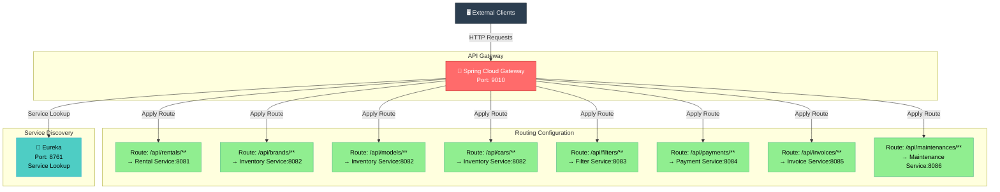

**Responsibilities:**
- Request routing based on URL patterns
- Service discovery from Eureka
- Load balancing

---

### 2. **Discovery Server - Eureka** (Port: 8761)

Central service registry where all microservices register themselves and publish health status.

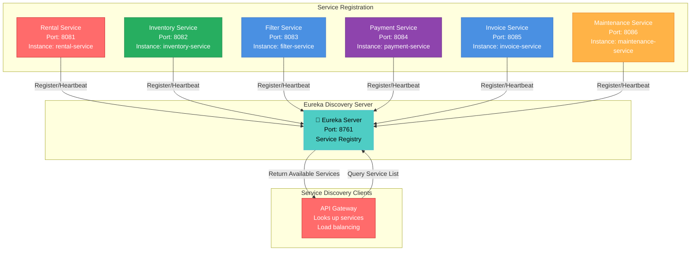

**Responsibilities:**
- Service registration and deregistration
- Health check monitoring via heartbeats
- Service lookup for dynamic routing

---

### 3. **Config Server** (Port: 8888)

Manages centralized configuration for all microservices from Git repository.

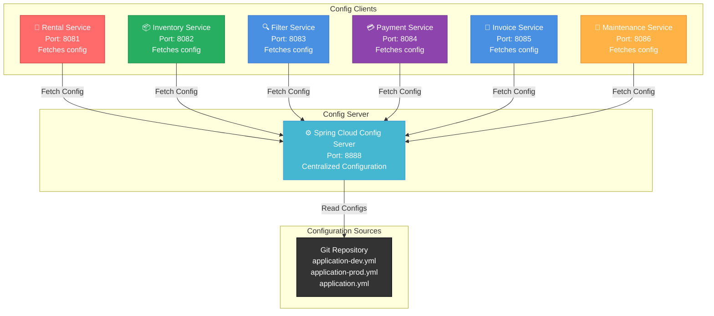

**Responsibilities:**
- Pull configuration from Git
- Serve environment-specific configs (Dev/Prod)
- Dynamic configuration updates

---

### 4. **Rental Service** (Port: 8081)

User-facing microservice for managing car rental transactions with payment processing and invoice generation.

**Database:** PostgreSQL

**Endpoints:**
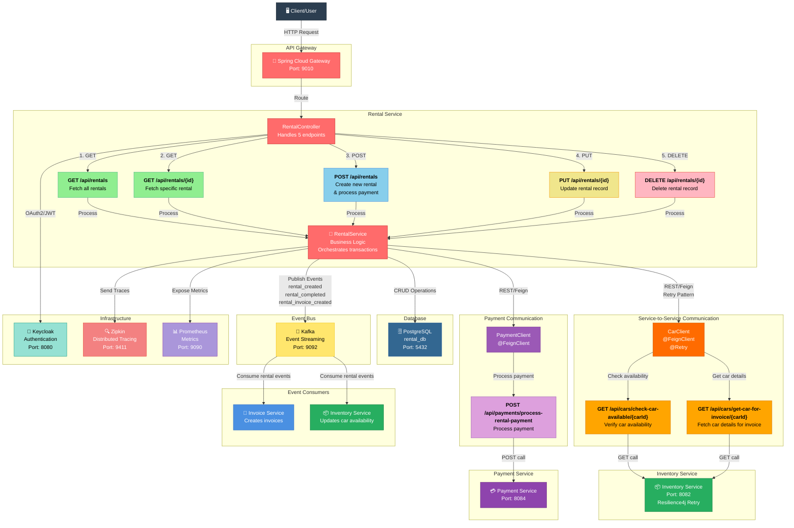

**Key Features:**
- Create rental transactions
- Process payments via Payment Service
- Check car availability via Inventory Service
- Publish rental events to Kafka
- Implements Retry pattern for resilience

**API:**
- `GET /api/rentals` - Fetch all rentals
- `GET /api/rentals/{id}` - Fetch specific rental
- `POST /api/rentals` - Create new rental (with payment)
- `PUT /api/rentals/{id}` - Update rental
- `DELETE /api/rentals/{id}` - Delete rental

---

### 5. **Inventory Service** (Port: 8082)

Admin-facing microservice for managing vehicle brands, models, and car inventory.

**Database:** PostgreSQL

**Endpoints divided into 3 resource types:**

#### Brands Management
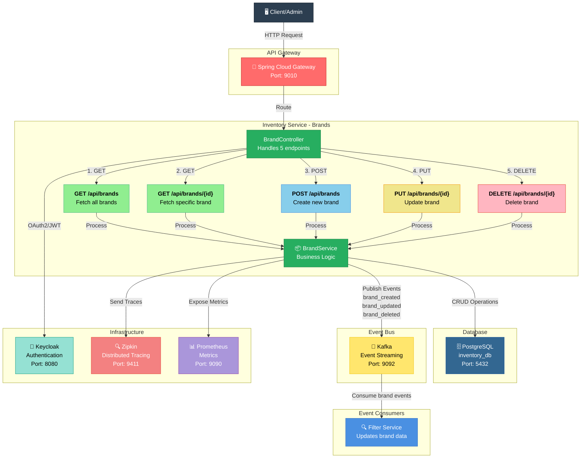

- `GET /api/brands` - Fetch all brands
- `GET /api/brands/{id}` - Fetch specific brand
- `POST /api/brands` - Create brand
- `PUT /api/brands/{id}` - Update brand
- `DELETE /api/brands/{id}` - Delete brand

#### Models Management
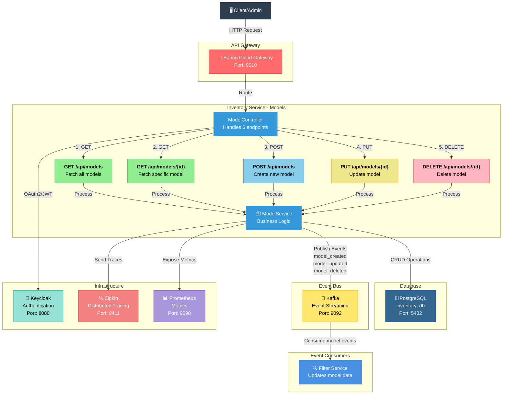

- `GET /api/models` - Fetch all models
- `GET /api/models/{id}` - Fetch specific model
- `POST /api/models` - Create model
- `PUT /api/models/{id}` - Update model
- `DELETE /api/models/{id}` - Delete model

#### Cars Management
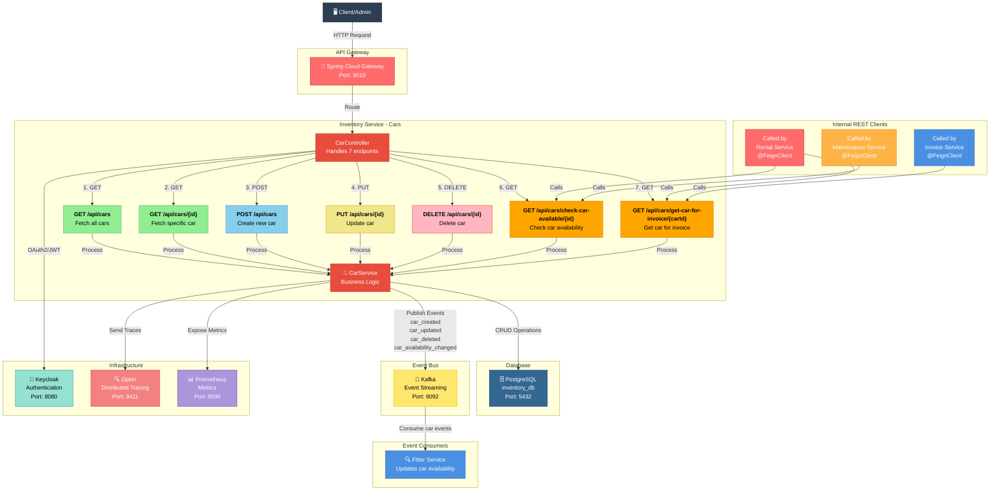

- `GET /api/cars` - Fetch all cars
- `GET /api/cars/{id}` - Fetch specific car
- `POST /api/cars` - Add new car
- `PUT /api/cars/{id}` - Update car details
- `DELETE /api/cars/{id}` - Delete car
- `GET /api/cars/check-car-available/{id}` - Check availability (used by Rental & Maintenance)
- `GET /api/cars/get-car-for-invoice/{carId}` - Get car details for invoicing

**Key Features:**
- Complete CRUD for brands, models, and cars
- Publish inventory change events to Kafka
- Internal endpoints for inter-service communication

---

### 6. **Filter Service** (Port: 8083)

User-facing read-optimized service for fast vehicle search and filtering.

**Database:** MongoDB (read-only cache)

**Endpoints:**
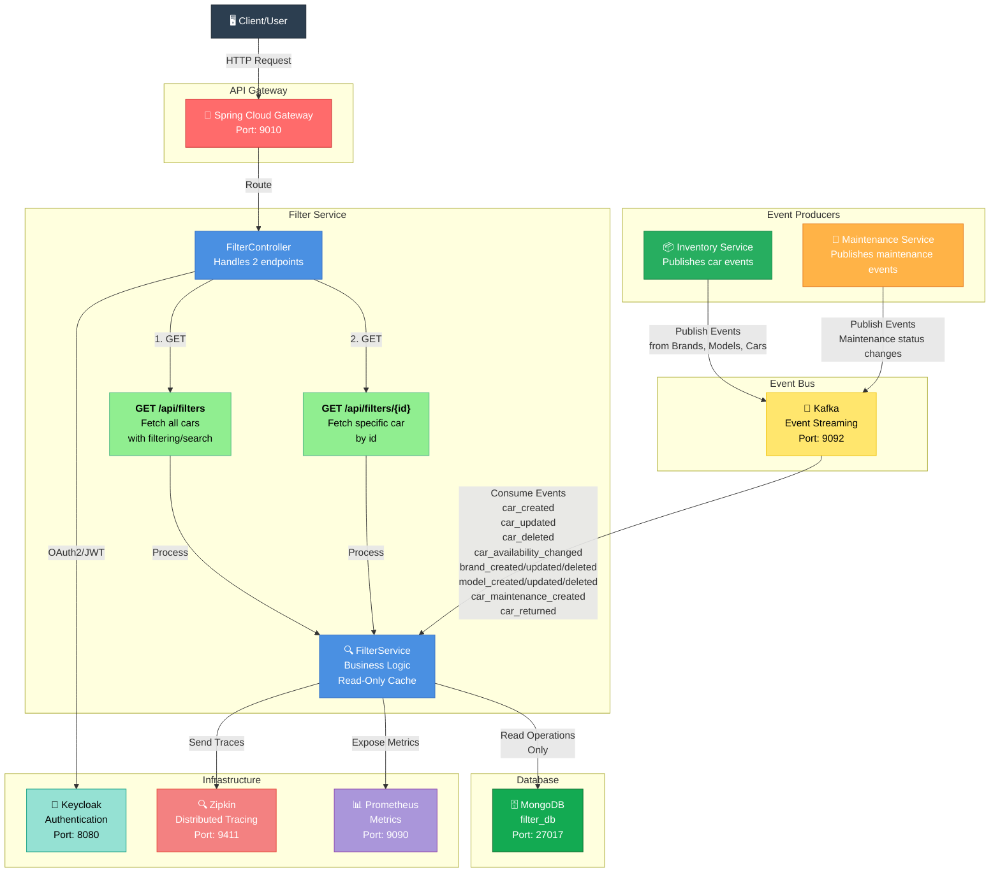

- `GET /api/filters` - Search all available cars with filters
- `GET /api/filters/{id}` - Fetch specific car details

**Key Features:**
- Optimized for read operations only
- Receives updates from Inventory & Maintenance via Kafka
- Provides fast search capability for users

---

### 7. **Payment Service** (Port: 8084)

Manages payment processing and transaction records for rental operations.

**Database:** PostgreSQL

**Endpoints:**
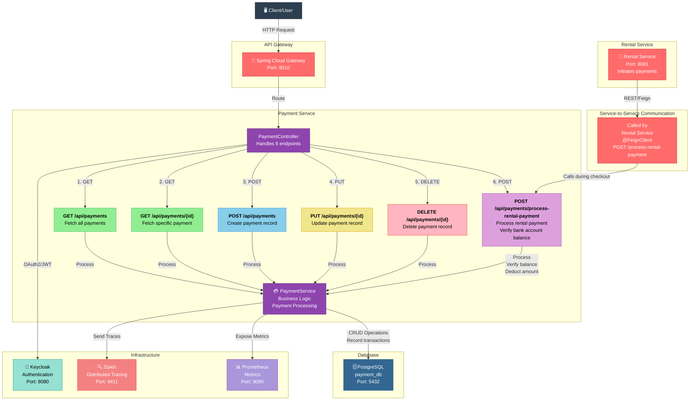

- `GET /api/payments` - Fetch all payment records
- `GET /api/payments/{id}` - Fetch specific payment
- `POST /api/payments` - Create payment record
- `PUT /api/payments/{id}` - Update payment record
- `DELETE /api/payments/{id}` - Delete payment record
- `POST /api/payments/process-rental-payment` - Process payment for rental (called by Rental Service)

**Key Features:**
- Verify bank account balances
- Process payments with balance deduction
- Record all payment transactions
- Used by Rental Service during checkout via Feign client

---

### 8. **Invoice Service** (Port: 8085)

Stores and retrieves rental transaction invoices.

**Database:** MongoDB

**Endpoints:**
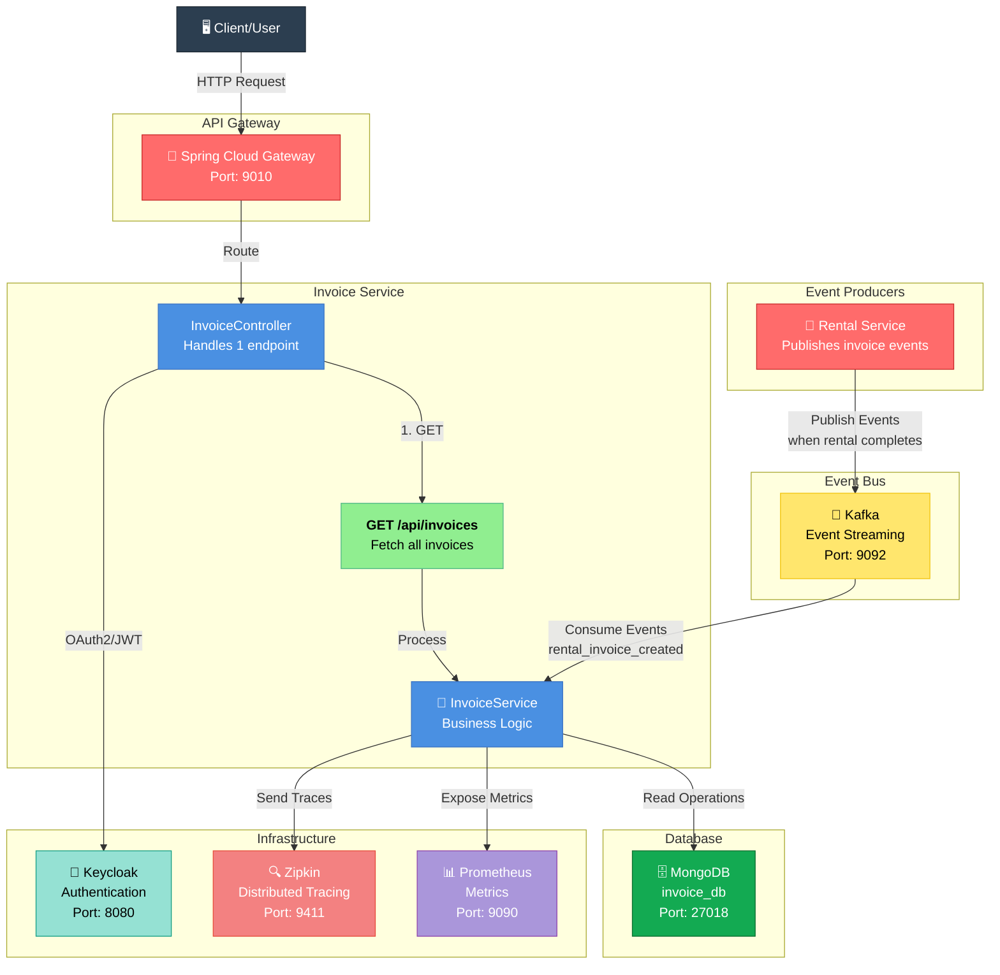

- `GET /api/invoices` - Fetch all invoices

**Key Features:**
- Read-only operations (no create/update/delete endpoints)
- Receives invoice data from Rental Service via Kafka
- Persists rental transaction records

---

### 9. **Maintenance Service** (Port: 8086)

Admin-facing service for managing vehicle maintenance operations.

**Database:** MySQL

**Endpoints:**
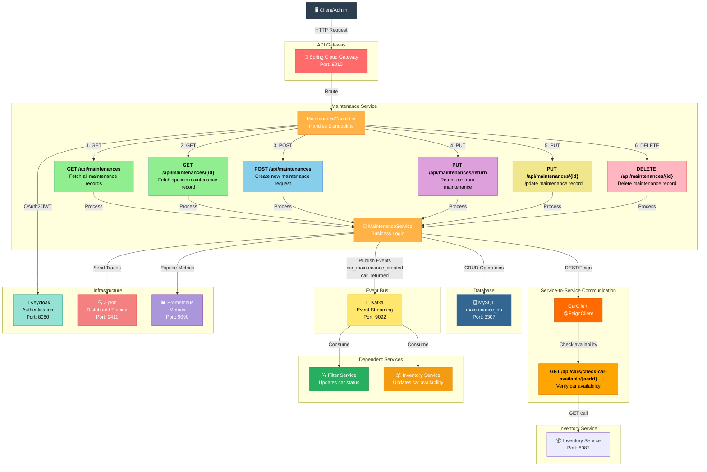

- `GET /api/maintenances` - Fetch all maintenance records
- `GET /api/maintenances/{id}` - Fetch specific maintenance
- `POST /api/maintenances` - Create maintenance request
- `PUT /api/maintenances/{id}` - Update maintenance record
- `PUT /api/maintenances/return` - Return car from maintenance
- `DELETE /api/maintenances/{id}` - Delete maintenance record

**Key Features:**
- Send cars for maintenance
- Track maintenance status
- Verify car availability via Inventory Service (Feign)
- Publish maintenance events to Kafka for Inventory & Filter updates

---

## API Endpoints

### Summary

| Service | Count | Type |
|---------|-------|------|
| Rental | 5 | CRUD + Transaction |
| Inventory - Brands | 5 | CRUD |
| Inventory - Models | 5 | CRUD |
| Inventory - Cars | 7 | CRUD + Special |
| Filter | 2 | Read-only |
| Payment | 6 | CRUD + Processing |
| Invoice | 1 | Read-only |
| Maintenance | 6 | CRUD + Special |
| **Total** | **45** | |

---

## Layered Architecture

Each microservice follows a **clean layered architecture** with clear separation of concerns:

### Data Layer (entities & repositories)
- **Entities**: JPA annotated POJO classes with relationships
- **Repositories**: JPA repository interfaces with custom query methods
- First Code approach applied (domain model first)

### Business Layer (business logic)

#### Abstracts (Interfaces)
- Service interfaces defining contracts
- Enable future technology integration
- Support SOLID principles (Liskov, Interface Segregation, Dependency Inversion)

#### Concretes (Implementations)
- Implement service interfaces
- Apply business rules and validation
- Orchestrate Feign REST calls
- Dispatch Kafka events
- Return DTOs (via ModelMapper)

#### Rules (Business Rules & Validation)
- Custom exception throwing for error scenarios
- Business logic validation before operations
- Improves code readability and error handling
- Prevents database errors with pre-checks

### API Layer (REST endpoints & clients)

#### Controllers
- REST endpoint definitions
- Dependency injection of business services
- Request/response handling

#### Clients (Feign)
- OpenFeign declarative REST clients for inter-service calls
- Resilience4j Retry pattern for fault tolerance
- Fallback error handling with custom exceptions
- Logging via SLF4J

---

## Communication Patterns

### Synchronous Communication (REST)

**Feign Clients with Retry Pattern:**

Used for critical operations requiring immediate response:

- **Rental → Inventory** (Resilience4j Retry)
    - Check car availability before rental
    - Get car details for invoice

- **Rental → Payment** (Resilience4j Retry)
    - Process payment during checkout

- **Maintenance → Inventory**
    - Verify car availability before maintenance

**Why Retry Pattern?**
- Handles transient failures (service temporarily unavailable)
- Configurable retry attempts and intervals
- Prevents cascading failures

### Asynchronous Communication (Kafka)

**Event-Driven Architecture:**

Used for eventual consistency and decoupled updates:

**Event Flows:**

1. **Rental Events**
    - `rental_created` → Inventory & Filter Services
    - `rental_completed` → Inventory & Filter Services
    - `rental_invoice_created` → Invoice Service

2. **Inventory Events**
    - `brand_created/updated/deleted` → Filter Service
    - `model_created/updated/deleted` → Filter Service
    - `car_created/updated/deleted` → Filter Service
    - `car_availability_changed` → Filter Service

3. **Maintenance Events**
    - `car_maintenance_created` → Inventory & Filter Services
    - `car_returned` → Inventory & Filter Services

---

## Key Design Patterns

### Architectural Patterns
- **Microservices** - Decomposed by business capability
- **API Gateway** - Single entry point
- **Service Discovery** - Eureka registry
- **Config Server** - Centralized configuration
- **Event-Driven Architecture** - Kafka for async communication

### Resilience Patterns
- **Retry Pattern** - Resilience4j for transient failures
- **Circuit Breaker** - Prevent cascading failures
- **Fallback** - Error handling for service failures

### Design Principles
- **SOLID Principles**
    - Single Responsibility: Each class has one reason to change
    - Open/Closed: Open for extension, closed for modification
    - Liskov Substitution: Interfaces enable interchangeable implementations
    - Interface Segregation: Specific interfaces for specific needs
    - Dependency Inversion: Depend on abstractions, not concrete classes

- **GRASP Principles**
    - Creator: Spring manages object creation
    - Controller: Service layer controls business logic
    - High Cohesion: Related responsibilities grouped
    - Low Coupling: Services communicate via interfaces

### Data Patterns
- **Repository Pattern** - Abstract data access
- **DTO Pattern** - Request/Response objects via ModelMapper
- **Database Per Service** - Microservice data isolation
- **Eventual Consistency** - Async updates via Kafka

---

## Setup & Deployment

### Prerequisites
- Java 17+
- Maven 3.8+
- Docker & Docker Compose
- Git

### Running the System

1. **Start Infrastructure (Docker Compose)**
   ```bash
   docker-compose up -d
   ```

   This starts:
    - Kafka (Port: 9092)
    - PostgreSQL instances
    - MySQL instance
    - MongoDB instances
    - Keycloak (Port: 8080)
    - Zipkin (Port: 9411)
    - Prometheus (Port: 9090)
    - Grafana (Port: 3000)

2. **Start Microservices**
   ```bash
   # Discovery Server
   cd discovery-server && mvn spring-boot:run
   
   # Config Server
   cd config-server && mvn spring-boot:run
   
   # API Gateway
   cd api-gateway && mvn spring-boot:run
   
   # All other services (in any order)
   cd rental-service && mvn spring-boot:run
   cd inventory-service && mvn spring-boot:run
   cd filter-service && mvn spring-boot:run
   cd payment-service && mvn spring-boot:run
   cd invoice-service && mvn spring-boot:run
   cd maintenance-service && mvn spring-boot:run
   ```

### Accessing Services

- **API Gateway**: `http://localhost:9010`
- **Eureka Dashboard**: `http://localhost:8761`
- **Keycloak**: `http://localhost:8080`
- **Zipkin**: `http://localhost:9411`
- **Prometheus**: `http://localhost:9090`
- **Grafana**: `http://localhost:3000`

---

## Key Features & Highlights

✅ **Enterprise Architecture**
- Microservices with clear boundaries
- Distributed systems patterns
- Scalable & maintainable codebase

✅ **Clean Code**
- SOLID principles throughout
- GRASP patterns applied
- Layered architecture per service

✅ **Resilience**
- Retry pattern for transient failures
- Fallback mechanisms
- Circuit breaker ready

✅ **Observability**
- Distributed tracing (Zipkin)
- Metrics collection (Prometheus)
- Visualization (Grafana)
- Structured logging (SLF4J)

✅ **Security**
- OAuth2/OIDC via Keycloak
- JWT token validation

✅ **Data Consistency**
- Strong consistency for critical operations (REST)
- Eventual consistency for updates (Kafka)

---

## Future Enhancements

- [ ] API rate limiting & throttling
- [ ] Advanced search filters
- [ ] Real-time notifications
- [ ] Advanced payment methods integration
- [ ] Vehicle tracking/GPS integration
- [ ] Machine learning for pricing optimization
- [ ] Mobile application
- [ ] Advanced analytics dashboard

---

## Project Statistics

- **Total Endpoints**: 45
- **Microservices**: 6
- **Infrastructure Services**: 3
- **Databases**: 3 (PostgreSQL, MySQL, MongoDB)
- **Event Topics**: 8+
- **Technology Stack**: 15+ frameworks/libraries

---

## Authors & Contribution

This project demonstrates enterprise-grade microservices architecture with emphasis on:
- Clean code and SOLID principles
- Distributed systems design
- Production-ready resilience patterns
- Comprehensive observability

---
