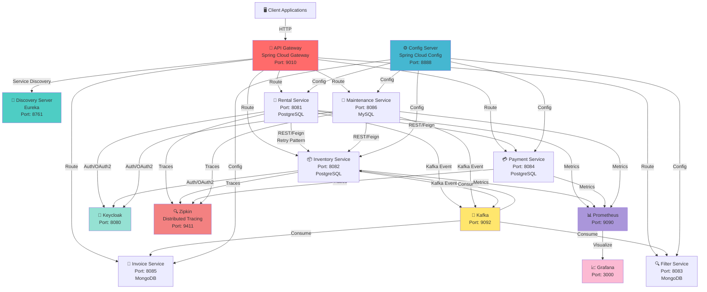

```mermaid
graph TB
    Client["🖥️ Client Applications"]
    
    Client -->|HTTP| Gateway["🔗 API Gateway<br/>Spring Cloud Gateway<br/>Port: 9010"]
    
    Gateway -->|Service Discovery| Discovery["📡 Discovery Server<br/>Eureka<br/>Port: 8761"]
    
    Gateway -->|Route| RentalSvc["🚗 Rental Service<br/>Port: 8081<br/>PostgreSQL"]
    Gateway -->|Route| InventorySvc["📦 Inventory Service<br/>Port: 8082<br/>PostgreSQL"]
    Gateway -->|Route| FilterSvc["🔍 Filter Service<br/>Port: 8083<br/>MongoDB"]
    Gateway -->|Route| PaymentSvc["💳 Payment Service<br/>Port: 8084<br/>PostgreSQL"]
    Gateway -->|Route| InvoiceSvc["📄 Invoice Service<br/>Port: 8085<br/>MongoDB"]
    Gateway -->|Route| MaintenanceSvc["🔧 Maintenance Service<br/>Port: 8086<br/>MySQL"]
    
    RentalSvc -->|REST/Feign<br/>Retry Pattern| InventorySvc
    RentalSvc -->|REST/Feign| PaymentSvc
    MaintenanceSvc -->|REST/Feign| InventorySvc
    
    RentalSvc -->|Kafka Event| Kafka["📨 Kafka<br/>Port: 9092"]
    MaintenanceSvc -->|Kafka Event| Kafka
    InventorySvc -->|Kafka Event| Kafka
    
    Kafka -->|Consume| FilterSvc
    Kafka -->|Consume| InvoiceSvc
    Kafka -->|Consume| InventorySvc
    
    RentalSvc -->|Auth/OAuth2| Keycloak["🔐 Keycloak<br/>Port: 8080"]
    InventorySvc -->|Auth/OAuth2| Keycloak
    MaintenanceSvc -->|Auth/OAuth2| Keycloak
    
    RentalSvc -->|Traces| Zipkin["🔍 Zipkin<br/>Distributed Tracing<br/>Port: 9411"]
    InventorySvc -->|Traces| Zipkin
    PaymentSvc -->|Traces| Zipkin
    MaintenanceSvc -->|Traces| Zipkin
    
    RentalSvc -->|Metrics| Prometheus["📊 Prometheus<br/>Port: 9090"]
    InventorySvc -->|Metrics| Prometheus
    PaymentSvc -->|Metrics| Prometheus
    MaintenanceSvc -->|Metrics| Prometheus
    
    Prometheus -->|Visualize| Grafana["📈 Grafana<br/>Port: 3000"]
    
    ConfigServer["⚙️ Config Server<br/>Spring Cloud Config<br/>Port: 8888"]
    ConfigServer -->|Config| RentalSvc
    ConfigServer -->|Config| InventorySvc
    ConfigServer -->|Config| FilterSvc
    ConfigServer -->|Config| PaymentSvc
    ConfigServer -->|Config| InvoiceSvc
    ConfigServer -->|Config| MaintenanceSvc
    
    style Gateway fill:#FF6B6B
    style Discovery fill:#4ECDC4
    style ConfigServer fill:#45B7D1
    style Kafka fill:#FFE66D
    style Keycloak fill:#95E1D3
    style Zipkin fill:#F38181
    style Prometheus fill:#AA96DA
    style Grafana fill:#FCBAD3
```